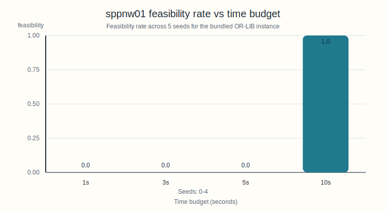

# SPP Tabu Search

`spp-tabu` is a Python tabu-search baseline for the Set Partitioning Problem (SPP). The current repository provides:

- an OR-LIB SPP parser,
- a randomized-greedy initial construction,
- a 1-flip tabu search with an adaptive feasibility penalty,
- a CLI for single runs, and
- a batch runner for repeated experiments.

The optimization model is:

```text
min sum_j c_j x_j
s.t. sum_j a_ij x_j = 1 for all i
x_j in {0,1}
```

## Installation

The package requires Python 3.10 or newer. All commands below assume you run them from the project root.

```bash
python -m venv .venv
source .venv/bin/activate  # Windows: .venv\Scripts\activate
pip install -e .
```

## Quick Start

Run the bundled OR-LIB benchmark instance:

```bash
spp-tabu --instance data/sppnw01.txt --seed 0 --time 10
```

Expected output on the documented local run:

```text
Best feasible cost=197940 | selected cols=48
```

Run the included batch evaluator on every tracked dataset:

```bash
python scripts/run_batch.py --pattern 'data/*.txt' --seeds 5 --time 10
```

Expected output on the documented local run:

```text
{'instance': 'data/sppnw01.txt', 'feas_rate': 1.0, 'best': 197940, 'avg': 197940}
```

Shorter time limits may fail to reach feasibility on `sppnw01`.

## Configuration Options

These are the current user-facing CLI options exposed by [`src/spp_tabu/cli.py`](src/spp_tabu/cli.py):

| Option | Type | Default | Description |
| --- | --- | --- | --- |
| `--instance` | path | required | Path to an OR-LIB SPP instance file. |
| `--seed` | int | `0` | Random seed used by the solver. |
| `--time` | float | `10.0` | Time limit in seconds. |
| `--iters` | int | `200000` | Maximum tabu-search iterations. |

The solver also has constructor-level defaults in [`src/spp_tabu/tabu.py`](src/spp_tabu/tabu.py). These are documented here for transparency, but they are not exposed in the CLI today.

| Parameter | Default | Role |
| --- | --- | --- |
| `base_tenure` | `10` | Minimum tabu tenure after a flip. |
| `tenure_rand` | `10` | Random extra tabu tenure added to `base_tenure`. |
| `stall_limit` | `20000` | Number of non-improving iterations before perturbation. |
| `cand_mult` | `30` | Candidate cap multiplier based on violated rows. |
| `lam` | `10.0` | Initial feasibility-penalty weight in the penalized objective. |

## Input Format and Benchmark Instance

[`src/spp_tabu/parser.py`](src/spp_tabu/parser.py) implements the OR-LIB set partitioning format:

```text
m n
cost_1 k_1 r_1 ... r_k
cost_2 k_2 r_1 ... r_k
...
cost_n k_n r_1 ... r_k
```

- `m` is the number of rows.
- `n` is the number of columns.
- Each column line stores its cost, the number of covered rows, and the covered row indices.
- OR-LIB row indices are 1-based in the file and converted to 0-based internally.

The tracked quick-start benchmark is `data/sppnw01.txt`, which has:

- `m = 135` rows,
- `n = 51975` columns,
- average rows per column `≈ 7.91`.

## Algorithm Overview

The solver in [`src/spp_tabu/tabu.py`](src/spp_tabu/tabu.py) uses a randomized construction phase followed by a 1-flip tabu search with adaptive penalty updates.


Implementation summary:

- `_initial_solution_randomized()` repeatedly builds a partial solution by selecting columns that cover uncovered rows while trying to minimize overlap.
- `_initial_solution_greedy()` repairs remaining uncovered rows and removes redundant selected columns when exact coverage is preserved.
- `solve()` then runs a 1-flip neighborhood search with tabu tenure, aspiration, adaptive penalty scaling for infeasibility, and a random perturbation after long stalls.
- Candidate moves are focused on columns incident to violated rows, with sampling used to cap the search effort.

## Example Runs

Single-instance run:

```bash
spp-tabu --instance data/sppnw01.txt --seed 0 --time 10
```

```text
Best feasible cost=197940 | selected cols=48
```

Batch run:

```bash
python scripts/run_batch.py --pattern 'data/*.txt' --seeds 5 --time 10
```

```text
{'instance': 'data/sppnw01.txt', 'feas_rate': 1.0, 'best': 197940, 'avg': 197940}
```

For this implementation and benchmark, `1s`, `3s`, and `5s` runs did not find a feasible solution in the documented local sweep.

## Experiment Setup and Results

The repository includes a small helper, [`scripts/benchmark_readme.py`](scripts/benchmark_readme.py), to regenerate the benchmark table and figure used below.

Documented experiment protocol:

- instance: `data/sppnw01.txt`
- seeds: `0..4`
- time budgets: `1`, `3`, `5`, `10` seconds
- run date: `2026-03-04`
- local environment: `Python 3.13.11`, `arm64`

Command used to regenerate the committed artifacts:

```bash
python scripts/benchmark_readme.py \
  --instance data/sppnw01.txt \
  --times 1 3 5 10 \
  --seeds 5 \
  --csv-out docs/results/sppnw01_time_sweep.csv \
  --svg-out docs/figures/sppnw01_feasibility_vs_time.svg
```

| time (s) | seeds | feasibility rate | best feasible cost | average feasible cost |
| --- | --- | --- | --- | --- |
| 1 | 5 | 0.0 | N/A | N/A |
| 3 | 5 | 0.0 | N/A | N/A |
| 5 | 5 | 0.0 | N/A | N/A |
| 10 | 5 | 1.0 | 197940 | 197940 |

The current implementation shows a sharp feasibility threshold on `sppnw01`: in this local sweep, no feasible solutions were found below 10 seconds.

The raw artifact backing the table is stored in [`docs/results/sppnw01_time_sweep.csv`](docs/results/sppnw01_time_sweep.csv).

## Visualization

The figure below summarizes feasibility rate versus time budget for the documented `sppnw01` sweep.



Best-cost values are kept in the results table rather than forced into a separate chart, because only the 10-second budget produced feasible solutions in the documented run.

## Code Structure

Repository map:

- [`src/spp_tabu/parser.py`](src/spp_tabu/parser.py): parses OR-LIB instances into the `SPPInstance` dataclass.
- [`src/spp_tabu/tabu.py`](src/spp_tabu/tabu.py): implements initialization, neighborhood evaluation, tabu logic, and solve-time bookkeeping.
- [`src/spp_tabu/cli.py`](src/spp_tabu/cli.py): resolves input paths, parses CLI options, and prints solver output.
- [`scripts/run_batch.py`](scripts/run_batch.py): evaluates one or more instances across multiple seeds at a fixed time limit.
- [`scripts/benchmark_readme.py`](scripts/benchmark_readme.py): regenerates the README benchmark CSV and SVG artifacts.

## Comparison With Other Methods

This comparison is qualitative and literature-based. Only tabu search is implemented in this repository.

| Method | Optimality guarantee | Scalability tendency | Feasibility handling | Implementation effort | Status in this repo |
| --- | --- | --- | --- | --- | --- |
| Exact branch-and-cut / MIP | Yes, when solved to optimality | Strong on moderate instances, can degrade sharply on very large dense cases | Enforced directly by the solver model | High | Not implemented |
| Genetic algorithms for SPP | No | Often scalable through population parallelism, but sensitive to encoding and repair design | Usually requires penalty or repair operators | Medium to high | Not implemented |
| Lagrangian-relaxation-style methods | Usually no direct guarantee without branch-and-bound integration | Often strong for bounding and decomposition | Commonly balances feasibility through multipliers and subproblem structure | High | Not implemented |
| This tabu-search baseline | No | Lightweight and practical for large neighborhoods with careful candidate control | Uses an adaptive penalty plus greedy repair and perturbation | Low to medium | Implemented |

Only tabu search is implemented here, so this section should be read as conceptual context rather than an empirical head-to-head benchmark.

## Benchmark Datasets

- `data/sppnw01.txt` is the tracked quick-start benchmark in this repository.
- The broader intended external benchmark family is the OR-LIB SPP suite, including `sppnw*`, `sppaa*`, `sppus*`, and `sppkl*`.
- Only one instance is committed here to keep the repository lightweight while preserving an out-of-the-box demo.

## Complexity Discussion

Using `nnz` for the total number of row incidences across all columns:

- parsing is `O(n + nnz)` time and `O(n + nnz)` memory,
- row-to-column index construction is `O(nnz)`,
- bitmask construction is `O(nnz)`,
- one flip delta evaluation is `O(|rows(j)|)`,
- candidate generation is proportional to the incident columns of violated rows before sampling,
- one tabu iteration is roughly `O(|candidate_set| * average_column_nnz)`,
- total runtime is bounded by the smaller of the time limit and the iteration cap,
- working memory is `O(m + n + nnz)`.

Practical note: Python big-integer row bitmasks are reasonable for the included `m = 135` instance, but they may become less attractive for much larger row counts.

## Future Work

- Expose advanced tabu parameters through the CLI.
- Add more tracked datasets or a scripted benchmark download workflow.
- Record per-iteration statistics for convergence plots and deeper analysis.
- Add baseline methods for empirical comparison.
- Add tests for parser behavior, CLI path resolution, and solver smoke runs.
- Investigate stronger diversification and repair operators.

## References

1. J.E. Beasley, "OR-Library: distributing test problems by electronic mail," *Journal of the Operational Research Society* 41(11), 1990. [OR-Library overview](https://people.brunel.ac.uk/~mastjjb/jeb/info.html)
2. OR-Library Set Partitioning benchmark page. [OR-Library set partitioning info](https://people.brunel.ac.uk/~mastjjb/jeb/orlib/sppinfo.html)
3. Fred Glover, "Tabu Search-Part I," *ORSA Journal on Computing* 1(3), 1989. [Paper entry](https://www.citedrive.com/en/discovery/tabu-searchpart-i/)
4. Fred Glover, "Tabu Search-Part II," *ORSA Journal on Computing* 2(1), 1990. [Paper entry](https://www.ivysci.com/en/articles/167082__Tabu_SearchPart_II)
5. E. Balas and M.W. Padberg, "Set Partitioning: A Survey," 1976. [NTIS entry](https://ntrl.ntis.gov/NTRL/dashboard/searchResults/titleDetail/ADA025600.xhtml)
6. P.C. Chu and J.E. Beasley, "Constraint Handling in Genetic Algorithms: The Set Partitioning Problem," *Journal of Heuristics* 4, 1998. [Author page](https://people.brunel.ac.uk/~mastjjb/jeb/spp.html)
